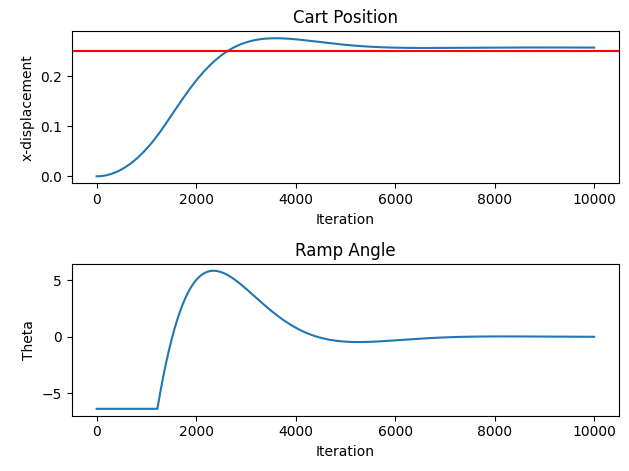
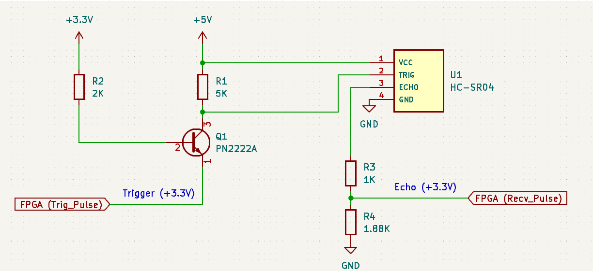
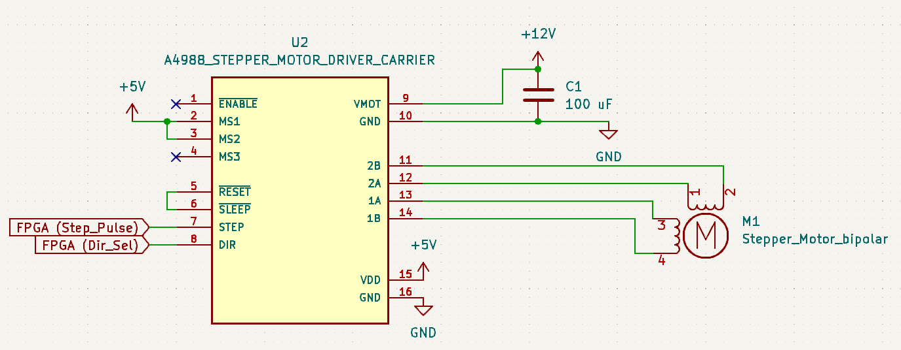
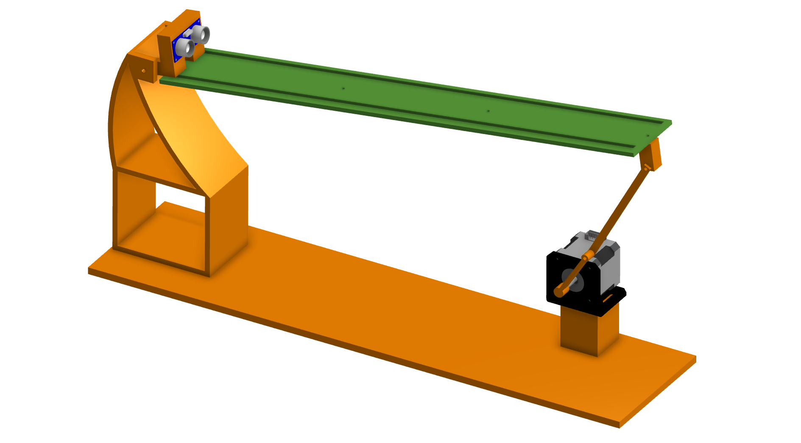

# autoDistance
The goal of this project is to implement a simple [PID controller](https://en.wikipedia.org/wiki/Proportional%E2%80%93integral%E2%80%93derivative_controller) using a FPGA. [(1)](https://www.youtube.com/watch?v=JFTJ2SS4xyA) and [(2)](https://www.youtube.com/watch?v=oy58S4beC9c) served as the inspiration for this project. Note that a FPGA is being used as an exercise. It is much more convenient to use a microcontroller for this application.

## PID Algorithm
Before starting to implement the PID controller in hardware, a [Python script](https://github.com/AlexDom513/autoDistance/blob/main/algo-dev/algo2.py) was used to understand the algorithm and the system it would be used in. The script was set up in such a way that the user can specify variables like the set-point, the PID gains, and the cart mass.

A simulation then shows how the cart position is affected by the changing angle of a ramp:

## FPGA Modules
### PulseController
The [PulseController](https://github.com/AlexDom513/autoDistance/blob/main/fpga-source/source/PulseController.vhd) module is responsible for interacting with the ultrasonic sensor. According to the [datasheet](https://github.com/AlexDom513/autoDistance/blob/main/datasheets/HCSR04.pdf), the FPGA must send a 10 microsecond trigger pulse. The sensor the sends eight 40 kHz pulses and detects whether there is a returned pulse. If there is a returned pulse, the time of high output from the sensor is proportional to the distance detected.

### PIDController
After obtaining the cart distance in the PulseController module, the [PIDController](https://github.com/AlexDom513/autoDistance/blob/main/fpga-source/source/PidController.vhd) module is used to compute an appropriate ramp angle so that the cart will be directed towards the ramp's center. Proportional gain (P) is a function of where the cart is located along the ramp. Integral gain (I) continues to increase while the cart's observed position is different from the target position. Derivative gain (D) is dependent on how quickly the cart is approaching the target position. A state machine is used to jump between states that contain different computations (error, gains, ramp angle, scaling/saturation).

### StepperController
Whenever a new ramp angle is computed, it is passed to the [StepperController](https://github.com/AlexDom513/autoDistance/blob/main/fpga-source/source/StepperController.vhd) module. This module translates the value into physical movement by the stepper motor attached to the ramp. Two state machines are used to implement this functionality (Stepper State Machine & Pulse State Machine). The Stepper State Machine has a counter that is used to track the position of the stepper motor. The counter is set to 0 during startup. We then monitor whether the output from PIDController is greater than or less than the current value of the counter. Depending on the condition, we will either have the stepper motor increment or decrement from its current position. A signal that controls the motor's direction is set low/high and the Pulse State Machine is used to send trigger pulses to a [A4988](https://components101.com/modules/a4988-stepper-motor-driver-module) motor controller. The stepper motor finally increments or decrements in the desired direction.

## Circuit Schematics
Note: toggled controlled signals (via switches) are NOT shown

### Sensor Circuit
Converts the +3.3V Trig_Pulse signal to +5V logic. Signal is connected to ultrasonic sensor (HC-SR04). The sensor outputs a +5V signal which is converted back to +3.3V before being passed to the FPGA.

### Stepper Circuit
Connects control signals (Step_Pulse, Dir_Sel) from the FPGA to the stepper control board (A4988). Since the design is using 1/8 microstepping, MS1 and MS2 are also tied to +5V.

## CAD
This was my first serious attempt at creating a 3D model! All parts were printed using PLA on a PRUSA MK3.

[My Parts](https://cad.onshape.com/documents/018887aac5e3fe98b3ecc4ac/w/28ee8de5f592833dfd0388a2/e/8ab51c28ebdef6fccae7c0ab?renderMode=1&uiState=657551bd4254d404bca63ac2) |
[HC-SR04 Model](https://grabcad.com/library/hcsr04-ultrasonic-sensor-1) |
[NEMA-17 Model](https://grabcad.com/library/nema17-42-40-1) |
[Motor Bracket](https://grabcad.com/library/nema-17-stepper-motor-mounting-bracket-2)

